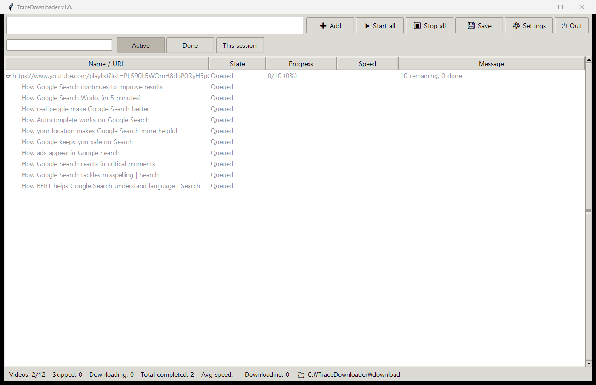
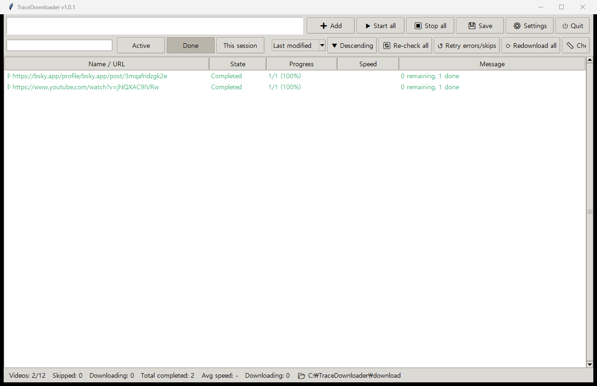
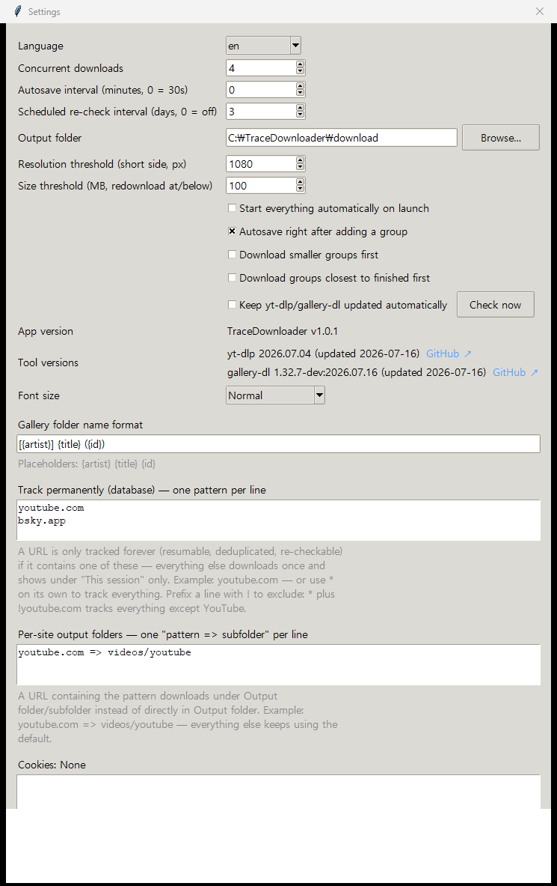
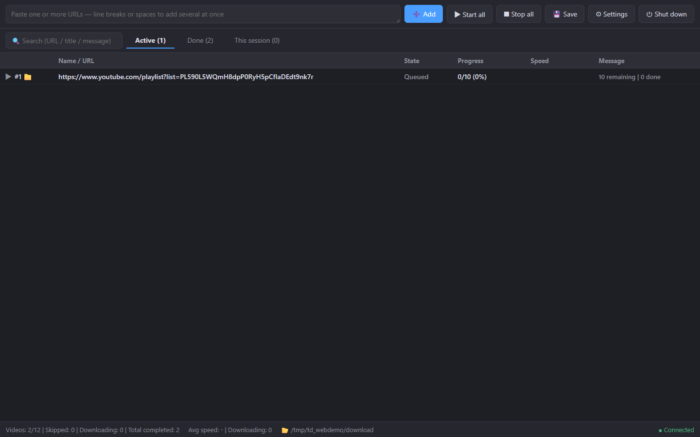

# TraceDownloader

A queue-based batch downloader built on top of [yt-dlp](https://github.com/yt-dlp/yt-dlp)
and [gallery-dl](https://github.com/mikf/gallery-dl). Paste a URL and it
figures out on its own whether yt-dlp or gallery-dl should handle it — no
per-site configuration required.

Two front ends share the same engine:
- **Windows version**: a native desktop app (tkinter) — double-click the
  `.exe`, no browser or server involved.
- **Web server version**: a small local web server (FastAPI) you control
  from any device's browser. Typically run headless on a home server/NAS;
  it works on any OS that runs Python (the one-shot install script targets
  Linux, other platforms run it from source).




## Features

- **Automatic routing** — every URL is tried against yt-dlp first, then
  gallery-dl, so channels, playlists, single videos, and image galleries
  all just work without picking a mode.
- **Two download modes, your choice per URL pattern** — anything matching
  a pattern you configure (e.g. `youtube.com`) is tracked persistently:
  resumable, deduplicated against what's already downloaded, and
  re-checkable for newly uploaded items (e.g. point it at a whole channel,
  then re-check later to pull only what's new). Everything else downloads
  once and only shows up in the current session's list (nothing written to
  the database). A lone `*` tracks everything, and a `!` prefix excludes:
  `*` plus `!youtube.com` tracks everything except YouTube.
- **Channels, playlists, and gallery artists as groups** — a YouTube
  channel, a playlist, or an image-site artist page each becomes one
  tracked group; re-checking it downloads only what was added since.
- **Scheduled re-checks** — optionally re-check every completed group for
  new uploads on a fixed interval (e.g. every 3 days), and exclude
  individual groups from bulk/scheduled re-checks.
- **Live progress**, pause/resume, priority downloads, drag-to-reorder,
  search.
- **Maintenance tools** — bulk re-check for new uploads, retry
  errored/skipped items, redownload anything below a resolution or file
  size threshold, find files the database thinks exist but don't.
- **Cookies** — paste a cookies.txt once and it's used by both tools, for
  any site that needs a login.
- **yt-dlp/gallery-dl stay up to date on their own** — both change often
  enough (site breakage, new extractors) that a copy downloaded once and
  never touched again goes stale fast. A background check refreshes them
  automatically (can be turned off), plus a "check now" button in Settings.
- **English and Korean UI**, switchable from Settings.

## Screenshots

**Windows app.** The *Active* tab: a whole playlist added as one group,
expanded to show its videos with per-item state, progress and speed. The
input box at the top takes any number of URLs at once; the status bar shows
totals and the output folder.


The *Done* tab keeps every finished group and the maintenance toolbar:
re-check everything for new uploads, retry errors/skips, redownload all,
check resolution/file size against a threshold, and find files that are
missing from disk. Right-clicking any row offers the same tools per group.



Settings — everything lives in one dialog: concurrency, scheduled
re-checks, output folder, per-site subfolders, tracking patterns (with `!`
exclusions), gallery folder naming, cookies, tool auto-update with current
version info, language and font size.



**Web server version** — the same features in a browser (dark UI), live
progress over SSE, drag-to-reorder, multi-select with the usual
Ctrl/Shift-clicks, and a connection indicator bottom-right.



## Quick start

### Windows

1. Download the latest `tracedownloader.exe` from
   [Releases](../../releases) and run it.
2. On first run it downloads yt-dlp, gallery-dl, and ffmpeg into a `bin/`
   folder next to the .exe. Everything else (the database, downloaded
   files) also lives next to the .exe, so the whole thing is portable —
   move the folder anywhere and it keeps working.

No browser, no port, nothing to open — it's a normal desktop window.

### Web server

On a Debian/Ubuntu-style Linux box (home server, NAS VM, LXC container):

```bash
git clone https://github.com/gmlwls768/tracedownloader.git
cd tracedownloader
bash deploy/install.sh
```

The script installs the few system packages it needs (`python3-venv`,
`ffmpeg`, `curl`), creates a `venv/`, downloads standalone
yt-dlp / gallery-dl / deno binaries into `bin/` (falling back to a pip
install when no standalone build exists for your CPU), and finishes by
printing the exact command to start the server:

```bash
APP_HOME=$PWD/data APP_BIN_DIR=$PWD venv/bin/uvicorn server:app --host 127.0.0.1 --port 8686
```

Then open `http://127.0.0.1:8686`. To reach it from other devices on your
LAN, use `--host 0.0.0.0` and open `http://<server-ip>:8686`. To run it as
a systemd service (start on boot, auto-restart), copy
`deploy/app.service.example` to `/etc/systemd/system/tracedownloader.service`,
adjust the paths inside, then
`systemctl daemon-reload && systemctl enable --now tracedownloader`.

On Windows or macOS the same server runs from source — see the next
section (the install script itself is Linux-only because it uses `apt`).

### From source

```bash
# Windows desktop app
python app.py

# Web server (Linux/Mac)
python3 -m venv venv && venv/bin/pip install -r requirements.txt
APP_HOME=./data venv/bin/uvicorn server:app --host 127.0.0.1 --port 8686
```

yt-dlp and gallery-dl need to be reachable — either drop them in a `bin/`
folder next to `engine/`, or have them on your `PATH`.

## Configuration

| Setting | What it does |
|---|---|
| Concurrent downloads | How many videos download at once |
| Output folder | Where files are saved (default: `./download`) |
| Scheduled re-check interval | Every N days, automatically re-check all completed groups for new uploads (0 = off); individual groups can opt out via the right-click menu |
| Track permanently (patterns) | One substring per line; URLs matching one are tracked in the database (resumable/deduplicated/re-checkable), everything else is session-only. `*` alone tracks everything; a `!` prefix excludes (e.g. `!youtube.com`) |
| Per-site output folders | One `pattern => subfolder` per line; a matching URL downloads under Output folder/subfolder instead |
| Gallery folder name format | Template for gallery folder names, e.g. `[{artist}] {title} ({id})` |
| Cookies | A cookies.txt (Netscape format), sent to both yt-dlp and gallery-dl |
| Resolution / size thresholds | Used by the "check resolution" / "check size" maintenance tools |
| Keep tools updated automatically | Periodic yt-dlp/gallery-dl/ffmpeg auto-update, plus a manual "check now" |
| Language | English or Korean |

Settings also shows each tool's version and source (yt-dlp, gallery-dl,
ffmpeg — a system/apt ffmpeg is shown as read-only), the app's own version
with a **"Check for app updates"** button, and a link to this repo.

> The download tools (yt-dlp / gallery-dl / ffmpeg) keep themselves current
> — that's what "keep tools updated automatically" covers (ffmpeg only when
> the app manages its own copy, i.e. the Windows build; a system ffmpeg is
> left to the OS). Updating **TraceDownloader itself** is separate; see below.

## Updating

- **Windows**: download the newest `tracedownloader.exe` from
  [Releases](../../releases) and replace the old one. Your `data/`, `bin/`,
  and downloads sit next to the .exe and are left alone.
- **Web server**: from the checkout, `bash deploy/update.sh` — it pulls the
  latest code, refreshes the venv if dependencies changed, and restarts the
  systemd service (your database, cookies, and downloads are untouched).
  The equivalent by hand:

  ```bash
  cd /path/to/tracedownloader
  git pull
  systemctl restart tracedownloader    # or re-run the uvicorn command
  ```

## Desktop helper for the web server version (optional)

When the server runs on a different machine than the one you browse from
(a NAS, an LXC container, ...), two conveniences need an agent on *your*
PC: watching the clipboard, and opening a finished file in your local
player/file explorer. The small script in `client/` does both — plain
Python stdlib, nothing to install.

1. Copy the `client/` folder to the (Windows) PC you browse from.
2. Run `start_watcher.bat` (background) or `start_watcher_console.bat`
   (with a log window). To start it on boot, put a shortcut to the .bat in
   `shell:startup`.
3. The first run creates `client_config.json` next to the script — edit it
   and restart:

| field | what it is | example |
|---|---|---|
| `server` | address of the web server | `http://192.168.1.50:8686` |
| `win_base` | the path under which **this PC** sees the server's output folder (mapped network drive or UNC share). Leave `""` to disable the open-file feature; clipboard watching still works | `Z:\media\downloads` |
| `open_port` | local port the web UI calls for its "open on desktop" requests | `8687` (default) |

What you get:

- **Clipboard watching** — copy any URL (or a whole block of text with
  several URLs) anywhere on your PC and it's added to the server
  automatically; copying an already-tracked group URL triggers a re-check.
- **Open video / Open folder** — the web UI's right-click "(desktop
  helper)" entries play the finished file with your default player, or open
  Explorer with the file pre-selected, by translating the server path
  through `win_base`.

## Project layout

```
engine/          task queue, SQLite-backed state, all yt-dlp/gallery-dl calls,
                 auto-update logic - the shared core, no UI code
  __init__.py      Engine class assembly, init/load-save/shutdown
  models.py        DB, Task, module-level constants/helpers, M()
  ephemeral.py     session-only (non-persistent) video/gallery download
  resolve.py       URL intake + persistent-group playlist resolve
  workers.py       download queue/workers, start-stop-reorder actions
  maintenance.py   done-tab tools, delete, apply_action() dispatch
  updater.py       background yt-dlp/gallery-dl self-update
  settings.py      settings get/set, cookies, state snapshot
i18n.py          English/Korean text shared by both front ends
app.py           Windows desktop app (tkinter) - imports engine directly,
                 no server involved
server.py        web server version: FastAPI REST + Server-Sent Events on
                 top of engine
static/index.html web UI served by server.py (no build step)
client/          optional helper for the web server version: clipboard
                 watching + "open on this PC" (only useful if the server
                 runs on a different machine than the one you browse from)
deploy/          web server install script (Linux), systemd unit template,
                 Windows PyInstaller build script
```

## Development

```bash
# Windows app
python app.py

# Web server, with auto-reload
venv/bin/uvicorn server:app --reload --host 127.0.0.1 --port 8686
```

`engine/` has no UI dependency either way and can be exercised directly
if you want to script against it.

## Disclaimer

TraceDownloader is a general-purpose front end for yt-dlp and gallery-dl. It
is not affiliated with, endorsed by, or connected to any of the sites it can
download from, nor with the yt-dlp or gallery-dl projects.

- The software is provided "as is", without warranty of any kind; you use it
  at your own risk (see [LICENSE](LICENSE)).
- You alone are responsible for what you download and how you use it. Only
  download content you own or are authorized to download, and comply with
  copyright law and the terms of service of each site.
- Intended for personal use. It does not bypass paywalls, DRM, or access
  controls, and does not host, distribute, or supply any media itself — it
  only automates tools you could run by hand.

## License

MIT — see [LICENSE](LICENSE). This project drives yt-dlp and gallery-dl as
external command-line tools (never imported as libraries); see
[THIRD_PARTY_NOTICES.md](THIRD_PARTY_NOTICES.md) for their licenses.

---

# TraceDownloader (한국어)

[yt-dlp](https://github.com/yt-dlp/yt-dlp)와
[gallery-dl](https://github.com/mikf/gallery-dl) 기반의 큐 방식 대량
다운로더입니다. URL만 붙여넣으면 yt-dlp와 gallery-dl 중 어느 쪽으로
처리할지 자동으로 판단합니다 — 사이트별 설정이 필요 없습니다.

두 프론트엔드가 같은 엔진을 공유합니다:
- **Windows 버전**: 네이티브 데스크톱 앱(tkinter) — exe 더블클릭,
  브라우저나 서버 없음.
- **웹서버 버전**: 가벼운 로컬 웹서버(FastAPI) — 아무 기기 브라우저로
  제어. 보통 홈서버/NAS에 headless로 띄워두며, 파이썬이 도는 OS라면
  어디서든 동작합니다 (원클릭 설치 스크립트만 리눅스용이고, 다른 OS는
  소스로 실행).

## 주요 기능

- **자동 판별** — 모든 URL을 yt-dlp로 먼저 시도하고, 안 되면 gallery-dl로
  시도합니다. 채널/재생목록/단일 영상/이미지 갤러리 전부 모드 선택 없이
  그냥 동작합니다.
- **URL 패턴별 두 가지 다운로드 방식** — 설정에서 지정한 패턴(예:
  `youtube.com`)에 걸리는 URL은 영구 추적됩니다: 이어받기, 중복 방지,
  새 영상 재확인이 모두 됩니다(채널 전체를 넣고, 나중에 재확인하면 새로
  올라온 것만 받습니다). 그 외 URL은 한 번만 받고 이번 세션 목록에만
  표시되며 DB에는 전혀 기록되지 않습니다. `*` 한 줄이면 전체 추적,
  `!` 접두어는 제외 — `*` + `!youtube.com`이면 유튜브만 빼고 전부 추적.
- **채널·재생목록·갤러리 아티스트를 그룹으로 추적** — 유튜브 채널,
  재생목록, 이미지 사이트의 아티스트 페이지가 각각 하나의 그룹이 되고,
  재확인하면 그 뒤에 추가된 것만 다운로드됩니다.
- **예약 재확인** — 완료된 그룹 전체를 정해진 주기(예: 3일)마다 자동으로
  재확인해 새 업로드를 받아옵니다. 특정 그룹만 전체/예약 재확인에서
  제외할 수도 있습니다.
- **실시간 진행률**, 일시정지/재개, 최우선 다운로드, 드래그 순서변경, 검색.
- **유지보수 도구** — 완료 그룹 일괄 재확인, 오류/건너뜀 재시도, 해상도·
  용량 기준 미달 재다운로드, DB엔 있는데 실제로는 없는 파일 찾기.
- **쿠키** — cookies.txt를 한 번 붙여넣으면 두 도구 모두에 전달되어,
  로그인이 필요한 사이트도 지원합니다.
- **yt-dlp/gallery-dl 자동 업데이트** — 둘 다 사이트 변경에 따라 자주
  업데이트가 필요한 도구라, 한 번 받고 방치하면 금방 낡습니다. 백그라운드
  자동 업데이트(끌 수 있음) + 설정의 "지금 확인" 버튼으로 즉시 갱신.
- **영어/한국어 UI**, 설정에서 전환 가능.

## 스크린샷

**Windows 앱.** 진행 중 탭 — 재생목록 하나가 그룹으로 추가되어 펼치면
영상별 상태·진행률·속도가 보입니다. 상단 입력창에 URL 여러 개를 한 번에
붙여넣을 수 있고, 하단 상태바에 합계와 출력 폴더가 표시됩니다.


완료 탭 — 끝난 그룹들과 유지보수 도구 모음: 전체 재확인(새 업로드),
오류/건너뜀 재시도, 전체 재다운로드, 해상도/용량 기준 검사, 누락 파일
찾기. 우클릭 메뉴로 그룹별 실행도 됩니다.


설정 — 동시 다운로드 수, 예약 재확인, 출력 폴더, 사이트별 하위폴더,
추적 패턴(`!` 제외 포함), 갤러리 폴더명, 쿠키, 도구 자동 업데이트와
현재 버전, 언어·글자 크기까지 한 화면에서.


**웹서버 버전** — 같은 기능을 브라우저에서 (다크 UI). SSE 실시간 진행률,
드래그 순서 변경, Ctrl/Shift 다중 선택, 우측 하단 연결 상태 표시.


## 빠른 시작

### Windows

1. [Releases](../../releases)에서 최신 `tracedownloader.exe`를 받아
   실행합니다.
2. 처음 실행할 때 yt-dlp/gallery-dl/ffmpeg를 exe 옆 `bin/` 폴더에 자동으로
   받습니다. DB와 다운로드 파일도 전부 exe 옆에 저장되므로 폴더째로
   옮겨도 그대로 동작합니다(포터블).

브라우저나 포트 없이, 그냥 평범한 데스크톱 창입니다.

### 웹서버 버전

데비안/우분투 계열 리눅스(홈서버, NAS VM, LXC 컨테이너)에서:

```bash
git clone https://github.com/gmlwls768/tracedownloader.git
cd tracedownloader
bash deploy/install.sh
```

스크립트가 필요한 시스템 패키지(`python3-venv`, `ffmpeg`, `curl`) 설치,
`venv/` 생성, yt-dlp/gallery-dl/deno 단독 바이너리를 `bin/`에 다운로드
(CPU에 맞는 빌드가 없으면 pip 설치로 자동 폴백)까지 처리하고, 마지막에
서버 시작 명령을 그대로 출력해줍니다:

```bash
APP_HOME=$PWD/data APP_BIN_DIR=$PWD venv/bin/uvicorn server:app --host 127.0.0.1 --port 8686
```

그 다음 `http://127.0.0.1:8686` 접속. 같은 공유기의 다른 기기에서
접속하려면 `--host 0.0.0.0`으로 띄우고 `http://<서버IP>:8686`으로
접속하세요. 부팅 시 자동 시작(systemd 서비스)은
`deploy/app.service.example`을 `/etc/systemd/system/tracedownloader.service`로
복사해 경로를 수정한 뒤 `systemctl daemon-reload && systemctl enable --now
tracedownloader` 하면 됩니다.

Windows/macOS에서도 같은 서버를 소스로 실행할 수 있습니다 — 아래 "소스로
실행" 참고 (설치 스크립트만 apt를 써서 리눅스 전용).

## 설정

| 설정 | 설명 |
|---|---|
| 동시 다운로드 수 | 동시에 받는 영상 개수 |
| 출력 폴더 | 저장 위치 (기본값: `./download`) |
| 예약 재확인 주기 | N일마다 완료 그룹 전체를 자동 재확인 (0=끄기). 우클릭 메뉴로 그룹별 제외 가능 |
| 영구 추적 패턴 | 한 줄에 하나씩. 이 패턴에 걸리는 URL만 DB에 영구 저장(이어받기/중복방지/재확인), 나머지는 세션 한정. `*` 한 줄이면 전체, `!` 접두어는 제외 (예: `!youtube.com`) |
| 사이트별 출력 폴더 | 한 줄에 `패턴 => 하위폴더` 형식. 패턴에 걸리는 URL은 출력 폴더/하위폴더 밑에 저장 |
| 갤러리 폴더명 형식 | 예: `[{artist}] {title} ({id})` |
| 쿠키 | cookies.txt(Netscape 형식), yt-dlp·gallery-dl 양쪽에 전달 |
| 해상도/용량 기준 | "해상도 검사"/"용량 검사" 도구가 사용하는 기준값 |
| 자동 업데이트 | yt-dlp/gallery-dl 주기적 자동 업데이트 + 수동 "지금 확인" |
| 언어 | 영어 또는 한국어 |

> 다운로드 도구(yt-dlp / gallery-dl)는 스스로 최신으로 유지됩니다("도구 자동
> 업데이트"). **TraceDownloader 앱 자체** 업데이트는 별개이며 아래를 참고하세요.

## 업데이트

- **Windows**: [Releases](../../releases)에서 최신 `tracedownloader.exe`를 받아
  기존 파일을 교체하면 됩니다. `data/`·`bin/`·다운로드 폴더는 exe 옆에 있어
  그대로 유지됩니다.
- **웹서버**: 체크아웃 폴더에서 `bash deploy/update.sh` — 최신 코드를 pull하고,
  의존성이 바뀌었으면 venv를 갱신한 뒤 systemd 서비스를 재시작합니다(DB·쿠키·
  다운로드는 건드리지 않음). 수동으로 하려면:

  ```bash
  cd /path/to/tracedownloader
  git pull
  systemctl restart tracedownloader    # 또는 uvicorn 명령 재실행
  ```

## 데스크톱 헬퍼 (웹서버 버전용, 선택)

서버가 내가 브라우저를 쓰는 PC와 다른 기기(NAS, LXC 등)에서 돌 때,
클립보드 감시와 "완료 파일을 내 PC 플레이어/탐색기로 열기" 두 가지는
내 PC 쪽 에이전트가 필요합니다. `client/` 폴더의 작은 스크립트가 둘 다
처리합니다 — 순수 파이썬 표준 라이브러리라 설치할 것이 없습니다.

1. `client/` 폴더를 브라우저를 쓰는 (Windows) PC로 복사
2. `start_watcher.bat`(백그라운드) 또는 `start_watcher_console.bat`(로그
   창) 실행. 부팅 자동 시작은 `shell:startup`에 bat 바로가기를 넣으면 됨
3. 첫 실행 시 스크립트 옆에 `client_config.json`이 생성됨 — 수정 후 재실행:

| 항목 | 의미 | 예시 |
|---|---|---|
| `server` | 웹서버 주소 | `http://192.168.1.50:8686` |
| `win_base` | **이 PC에서** 서버의 출력 폴더가 보이는 경로 (네트워크 드라이브 매핑 또는 UNC 공유). `""`로 비우면 파일 열기 기능만 꺼지고 클립보드 감시는 계속 동작 | `Z:\media\downloads` |
| `open_port` | 웹 UI가 "열기" 요청을 보낼 로컬 포트 | `8687` (기본값) |

되는 것:

- **클립보드 감시** — PC 어디서든 URL(여러 개가 섞인 텍스트도)을 복사하면
  자동으로 서버에 추가. 이미 추적 중인 그룹 URL을 다시 복사하면 재확인이
  트리거됨.
- **동영상 열기 / 파일 위치 열기** — 웹 UI 우클릭의 "(데스크톱 헬퍼)"
  항목이 `win_base` 경로 변환을 거쳐 기본 플레이어로 재생하거나, 해당
  파일이 선택된 상태로 탐색기를 엽니다.

## 면책 조항

TraceDownloader는 yt-dlp와 gallery-dl을 위한 범용 프론트엔드일 뿐이며,
다운로드 대상이 되는 어떤 사이트와도, yt-dlp·gallery-dl 프로젝트와도
제휴·후원·연관 관계가 없습니다.

- 이 소프트웨어는 "있는 그대로" 제공되며 어떠한 보증도 없습니다. 사용에
  따른 책임은 전적으로 사용자에게 있습니다([LICENSE](LICENSE) 참고).
- 무엇을 어떻게 다운로드하는지는 전적으로 사용자 책임입니다. 본인이 권리를
  가졌거나 다운로드가 허용된 콘텐츠만 받고, 저작권법과 각 사이트의 이용약관을
  준수하세요.
- 개인적 용도를 전제로 합니다. 유료 장벽·DRM·접근 제어를 우회하지 않으며,
  어떤 미디어도 자체적으로 호스팅·배포·제공하지 않습니다 — 직접 실행할 수
  있는 도구를 자동화할 뿐입니다.

## 라이선스

MIT — [LICENSE](LICENSE) 참고. yt-dlp와 gallery-dl은 외부 실행파일로
호출만 할 뿐 라이브러리로 가져오지 않습니다 — 각 도구의 라이선스는
[THIRD_PARTY_NOTICES.md](THIRD_PARTY_NOTICES.md)를 참고하세요.
